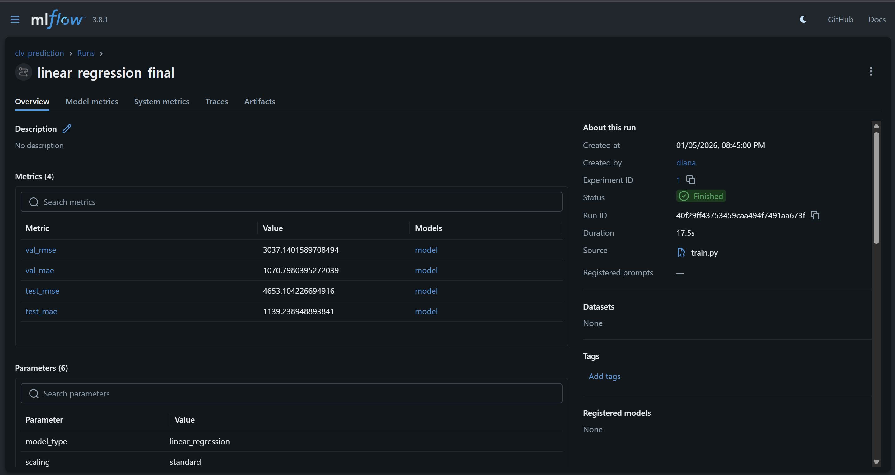
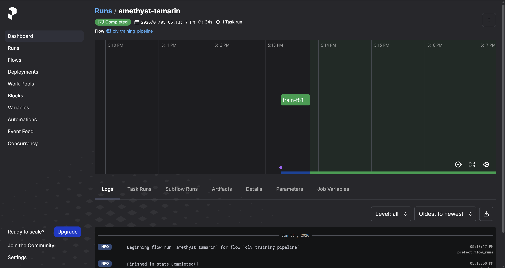
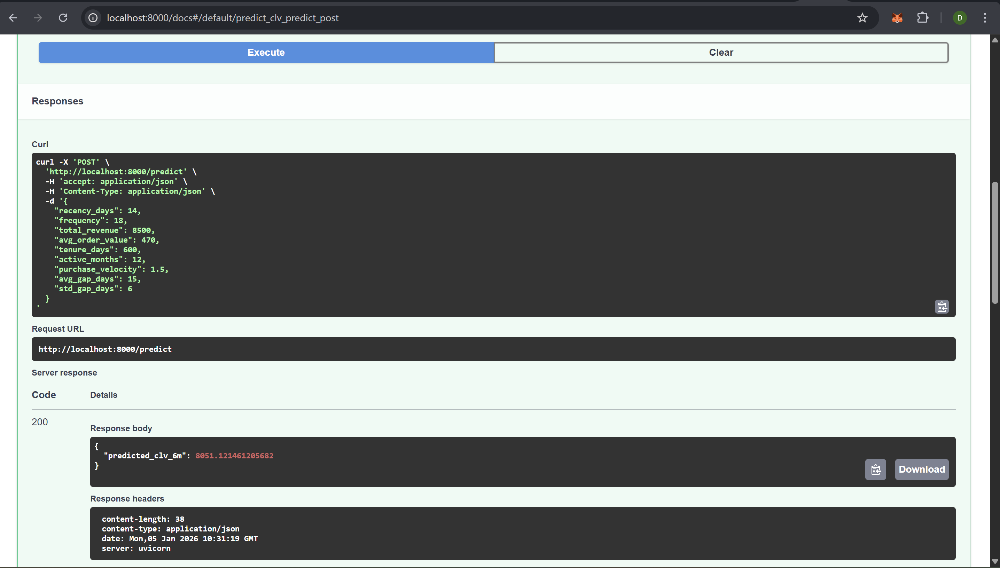
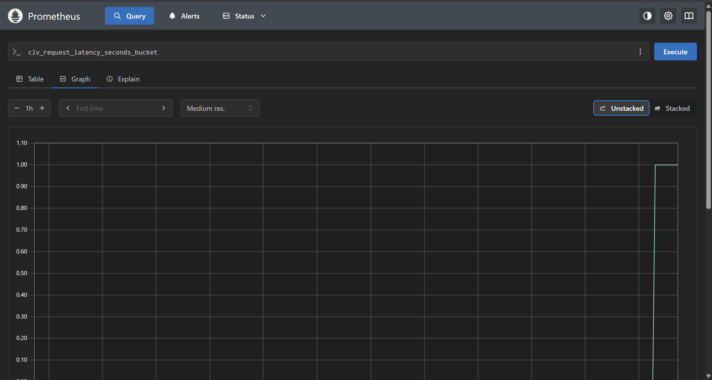
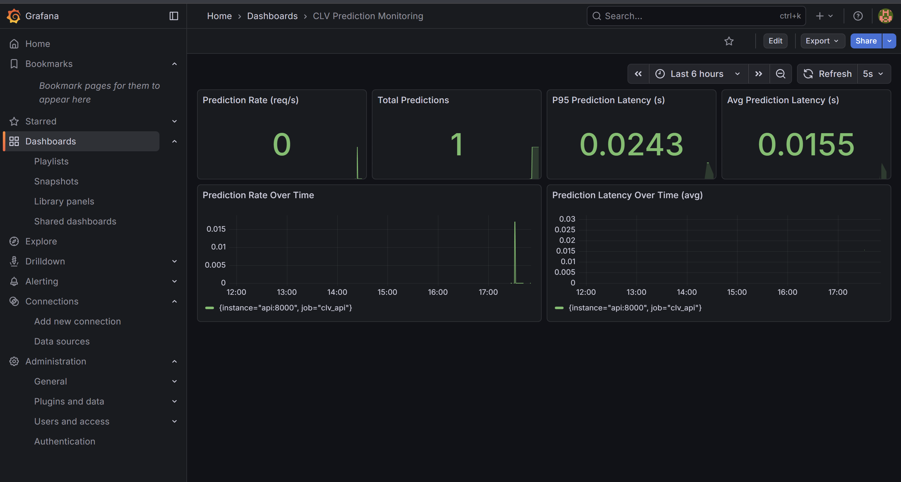
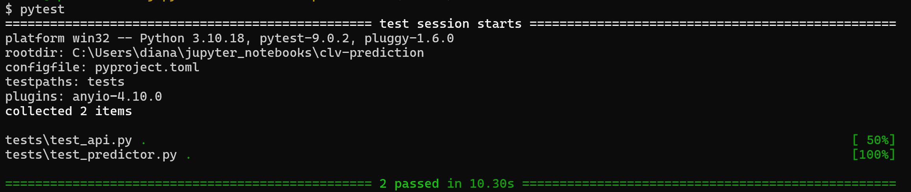
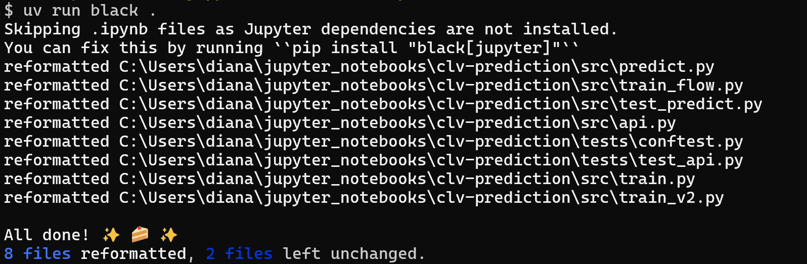
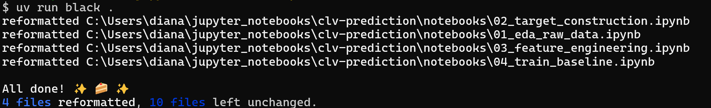
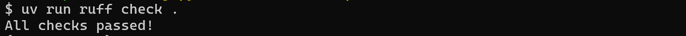

# :shopping_cart: CLV Prediction

## 📌Business Problem
Predict **6-month Customer Lifetime Value (CLV)** for each customer based on historical transaction behavior from the
[Online Retail II dataset](https://archive.ics.uci.edu/dataset/502/online+retail+ii).

The objective is to:
- Identify high-value customers for retention and marketing
- Build a **production-ready ML system** with experiment tracking, orchestration, monitoring, and reproducibility

---

## CLV Definition (Regression Target)

**CLV_6M** = Total revenue generated by a customer in the **6 months after** a fixed reference date  
(reference date: `2011-06-01`)

The modeling dataset is a **single snapshot**, customer-level table created using only historical data prior to the cutoff.

---

## Feature Summary

| Feature           | Description                                 |
|-------------------|---------------------------------------------|
| recency_days      | Days since last purchase                    |
| frequency         | Number of invoices                          |
| total_revenue     | Historical spend                            |
| avg_order_value   | Average revenue per order                   |
| tenure_days       | Customer lifetime                           |
| active_months     | Number of months with activity              |
| purchase_velocity | Purchases per active month                  |
| avg_gap_days      | Average gap between purchases               |
| std_gap_days      | Purchase interval variability               |
| clv_6m            | Target variable                             |

---

## 💡Project Background

This repo extends a machine learning notebook into a full MLOps workflow following the Machine Learning Zoomcamp Capstone Project guidelines. 

It covers:
- Data preparation and EDA
- Training and selecting the best model
- Experiment tracking using MLFlow (additional)
- Serving via FastAPI
- Monitoring using Prometheus and Grafana (additional)
- Docker for reproducibility
- Applying best practices (additional):
    - Unit tests
    - Integration test
    - Linter and code formatter
    - Makefile
    - Pre-commit hooks
    - CI/CD pipeline

---

## ⚙️ Tech Stack & Architecture

| Tool                    | Purpose                                |
| ----------------------- | -------------------------------------- |
| Pandas, scikit-learn    | Data handling and modeling             |
| MLflow                  | Experiment tracking and model registry |
| Prefect                 | Orchestration                          |
| FastAPI, Docker         | Serving and containerization           |
| Prometheus + Grafana    | Monitoring metrics and dashboards      |
| GitHub Actions          | CI/CD pipeline                         |
| Black + Ruff            | Code Quality                           |

System flow:
`online_retail_II.xlsx` → `train.py` (MLflow logs & registered the best model) → `FastAPI app` (serves model) → `Docker + docker-compose` → Prometheus scrapes `/metrics` → Grafana dashboards visualize.

---

# 🤖 Model Training

Multiple models were trained and evaluated:
- Linear Regression
- Random Forest egressor
- Gradient Boosting Regressor

The best-performing pipeline was registered in `MLflow` with metrics logged and artifacts stored.

---

## 🧪Reproducibility

All experiments are reproducible via:
- Locked dependencies (`uv.lock`)
- Training logic is exported to `train.py`
- Prediction logic is in `predict.py`
- Deterministic feature pipeline
- Versioned training scripts
- MLflow experiment tracking

---

## 🚀 Model Deployment
The model is deployed using FastAPI and served via `api.py`. It exposes:
- `/predict` endpoint for real-time predictions
- `/health` endpoint for service status
- `/metrics` endpoint for Prometheus monitoring

---

## 📈 Monitoring
Prometheus and Grafana are integrated for live monitoring:
- Request count, latency, and response size
- Dashboard panels for operational metrics
- Docker Compose orchestrates all services

## 📁 Project Structure
```
.
├── .github/workflows/
│ └── ci.yaml
├── data/                               # Ignored
│ ├── raw/ 
│ └── processed/
├── images/
├── monitoring/
│ └── prometheus.yml
├── notebooks/
│ ├── 01_eda_raw_data.ipynb
│ ├── 02_target_contruction.ipynb
│ ├── 03_feature_engineering.ipynb
│ └── 04_train_baseline.ipynb
├── src/
│ ├── api.py                            # FastAPI service
│ ├── train.py                          # Model training + MLflow logging
│ ├── predict.py                        # Inference logic
│ └── train_flow.py                     # Prefect orchestration
├── tests/
│ ├── test_api.py                       # Integration test
│ └── test_predictor.py                 # Unit test
├── models/                             # Ignored (artifacts)
├── docker-compose.yml 
├── Dockerfile
├── Makefile
├── pyproject.toml
├── requirement.txt
└── README.md
```

---

## :anchor: Project Usage Guide

This section describes how to set up, train, orchestrate, test, and serve the CLV prediction system following a production-oriented ML workflow.

### 1. Clone the Repository
```
git clone https://github.com/deedeepratiwi/clv-prediction.git
cd clv-prediction
```

### 2. Environment & Dependency Setup

This project uses uv for fast, reproducible dependency management.
```
uv venv
uv sync --locked
```

Activate the environment if needed:
```
source .venv/bin/activate  # Linux / macOS
.venv\Scripts\activate     # Windows
```

### 3. Download the Dataset

Download the dataset from [UCI Online Retail II](https://archive.ics.uci.edu/dataset/502/online+retail+ii) and place it in the `data/` folder:
```
data/
├── raw/
│   └── online_retail_II.xlsx
├── processed/
```

### 4. Exploratory Data Analysis (EDA)

EDA is performed in notebooks for transparency and reproducibility.
```
notebooks/
├── 01_eda_raw_data.ipynb
├── 02_target_construction.ipynb
├── 03_feature_engineering.ipynb
├── 04_train_baseline.ipynb
```
These notebooks analyze:
- missing values
- feature distributions
- CLV target behavior
- feature relevance

Note: Notebooks are for exploration only. Production logic lives in `src/`.

### 5. Model Training & Experiment Tracking (MLflow)

To train models and log experiments:
```
make run
```

This will:
- Train multiple models
- Track metrics and artifacts using MLflow
- Register the best-performing model in the Model Registry

To inspect experiments:
```
mlflow ui --backend-store-uri sqlite:///mlflow.db
```

Open: http://localhost:5000

You can explore:
- Experiments
- Runs
- Registered models



### 6. Workflow Orchestration (Prefect)
The training pipeline is orchestrated using Prefect, enabling reproducible and observable workflows.

To run the Prefect flow locally:
```
python src/train_flow.py
```
The flow coordinates:
- data loading
- feature preparation
- model training
- model registration

This simulates a production-style batch ML pipeline.



### 7. Model Inference (Local)

To run a sample prediction using the trained model:
```
python src/test_predict.py
```

Expected output:
```
Predicted_clv_6m: 8051.121461205699
```

### 8. API Service (FastAPI)

Run the prediction service locally:
```
make api
```

Available endpoints:
- `POST /predict` → Generate CLV predictions
- `GET /health` → Service health check
- `GET /metrics` → Prometheus metrics

API docs:
`http://localhost:8000/docs` 

Example request:
```
curl -X POST "http://localhost:8000/predict" \
     -H "Content-Type: application/json" \
     -d @./test.json
```

Expected result:
```
{"predicted_clv_6m":8051.121461205699}
```

### 9. Containerized Deployment (Docker)

Run the full stack using Docker Compose:
```
docker-compose up --build
```

This starts:
- FastAPI services
- Prometheus (metrics collection)
- Grafana (monitoring dashboard)

### 10. Monitoring & Observability

- **FastAPI**: http://localhost:8000/docs



- **Prometheus**: http://localhost:9090
    - Example metric: `clv_request_latency_seconds_bucket`



- **Grafana**: http://localhost:3000
    - Login: `admin` / `admin`
    - Add new connection: http://prometheus:9090
    - Import dashboard JSON from `monitoring/`



### 11. Best Practices & Automation

This project follows industry best practices:
- Unit & integration tests:
```
make test
```



- Linting & formatting:
```
make format
make lint
```







- Pre-commit hooks:
```
pre-commit install
```
- CI/CD:
    - GitHub Actions automatically run linting and tests on every push and PR.
